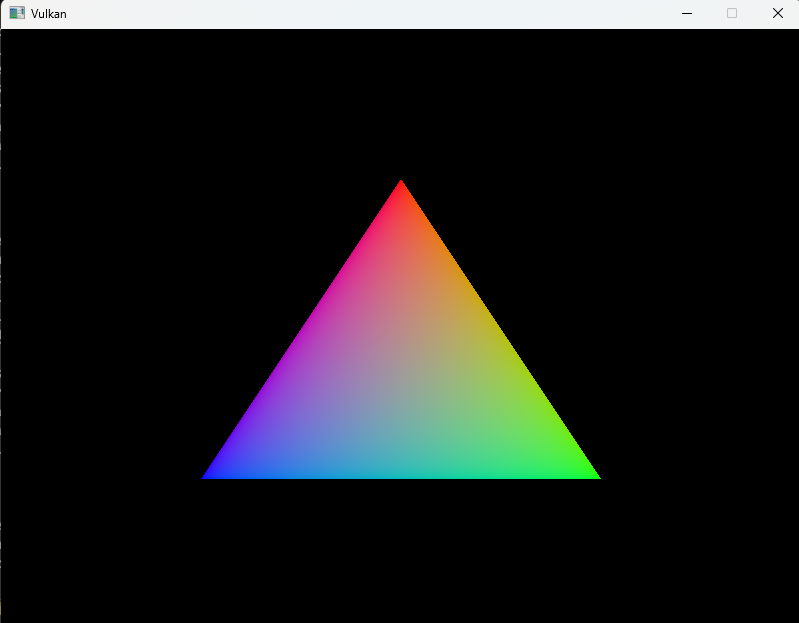

# P.R.I.S.M - Vulkan Study Module

이 리포지토리는 **Vulkan Graphics API**를 학습하기 위한 프로젝트입니다.
Visual Studio 2022와 CMake 환경에서 구성되었으며, Windows 환경에서의 개발을 기준으로 합니다.

## 🛠 Development Environment (개발 환경)

* **IDE**: Visual Studio 2022
* **Build System**: CMake 3.20+
* **Language**: C++17 Standard
* **Libraries**:
    * Vulkan SDK (Latest)
    * GLFW (3.4)
    * GLM (1.0.2)

---

## 📂 Repository Structure

디렉토리 구조입니다.
(각 프로젝트 폴더 내부에 소스 코드와 `CMakeLists.txt`가 포함되어 있습니다.)

~~~text
📦 Project_Root
 ┣ 📂 assets                  # 실행 결과 스크린샷 및 리소스 저장소
 ┣ 📂 Dependencies            # 외부 라이브러리 (GLFW, GLM 등)
 ┣ 📂 Vulkan_Basic            # [Project 1] Vulkan 기초 (삼각형 렌더링)
 ┣ 📜 .gitignore
 ┗ 📜 README.md
~~~

---

## 🚀 Projects

이 섹션에는 진행된 프로젝트들의 실행 결과와 간략한 설명을 기록합니다.

### 1. Vulkan Basic (Triangle Rendering)
Vulkan의 가장 기초적인 파이프라인을 구축하여 화면에 삼각형을 렌더링하는 예제입니다.

* **주요 학습 내용**:
    * Vulkan Instance & Logical Device 생성
    * Swapchain 및 ImageView 설정
    * Graphics Pipeline 구축 (Vertex/Fragment Shader)
    * Render Pass & Framebuffer 연결
    * Command Buffer 기록 및 비동기 실행 (Semaphore/Fence)

**📷 실행 결과 (Result)**

---

### 2. (Next Project...)
*추후 업데이트 예정입니다.*

---

## ⚡ How to Build (빌드 방법)

이 프로젝트는 **CMake**를 사용하여 빌드합니다.

1.  **Clone Repository**
    ~~~bash
    git clone [레포지토리 주소]
    ~~~
2.  **Open in Visual Studio**
    * Visual Studio를 실행하고 `폴더 열기(Open Folder)`로 프로젝트 루트를 엽니다.
3.  **CMake Configuration**
    * `CMakeLists.txt`를 기반으로 자동으로 구성이 진행됩니다.
    * *Note: 라이브러리 경로(`Dependencies`)는 로컬 환경에 맞게 `CMakeLists.txt` 수정이 필요할 수 있습니다.*
4.  **Run**
    * 시작 항목을 `VulkanApp.exe`로 선택하고 실행(`F5`)합니다.

---

## 📝 License

This project is for educational purposes.
